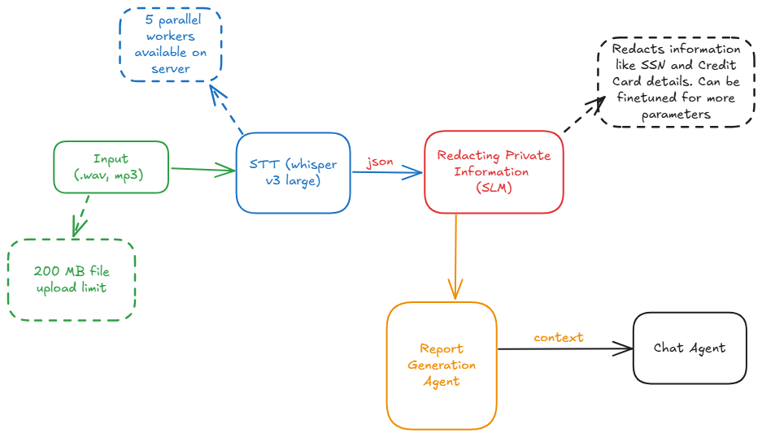

# 🎙️ Voicel

A comprehensive solution for processing customer support interactions with AI-powered transcription, PII sanitization, and automated report generation with realtime chatting through a chatbot that has knowledge of the report.


## Features ✨
- 🎶 Batch audio processing (up to 3 files simultaneously)
- 🔒 Automatic PII redaction (SSN, credit cards)
- 📄 Structured report generation with Gemini AI
- 📁 PDF export with consistent formatting
- 💬 Context-aware chat interface with Llama 3
- ⚡ FastAPI backend with parallel processing


## Architecture



## Project Structure 🗂️
```bash
.
├── client/
│   ├── app/                  # Streamlit frontend
│   │   ├── main.py           # Renamed: customer_support_frontend.py
│   │   ├── config.py         # Renamed from load_api.py
│   │
├── server/
│   ├── server.py         # Renamed from whisperserver.py


```

## Installation ⚙️
```bash
# Clone repository
git clone https://github.com/AbhiramVSA/voicel.git
cd voicel

# Set up
uv sync

```

## Configuration 🔧
Create `.env` file in client/app:
```env
GROQ_API_KEY=your_key_here
GEMINI_API_KEY=your_key
WHISPER_ENDPOINT=http://your-server/transcribe-batch
SANITIZE_ENDPOINT=http://your-server/sanitize
```

## Usage 🚀
```bash
# Start backend (in server directory)
uvicorn api_server:app --host 0.0.0.0 --port 8000

# Start frontend (in client/app directory)
streamlit run main.py
```


